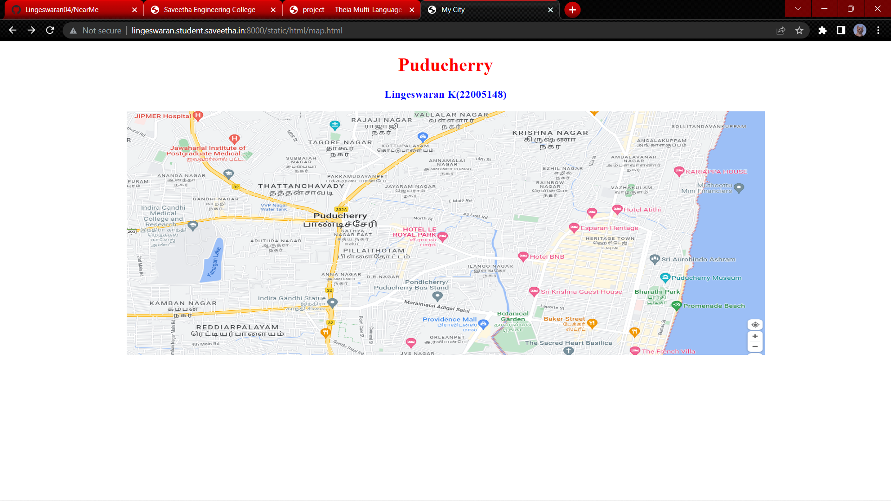
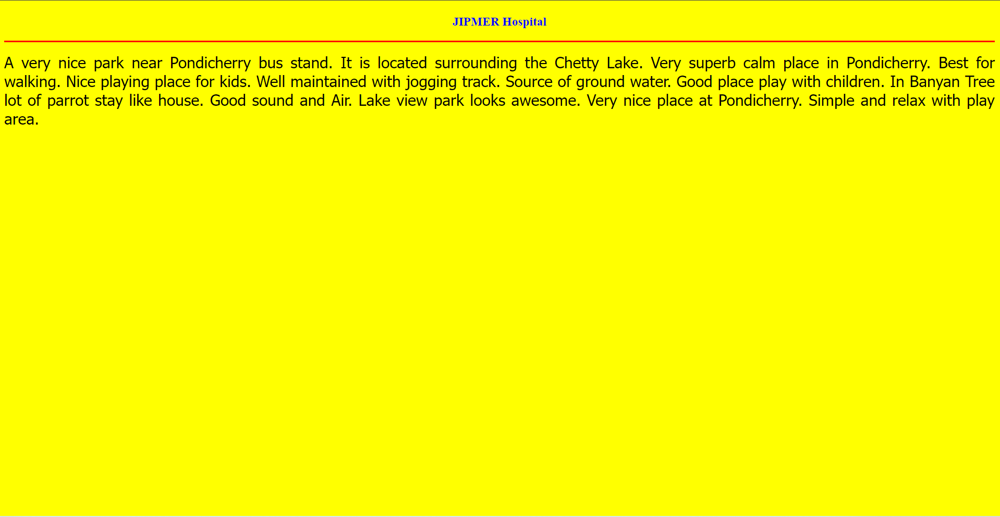
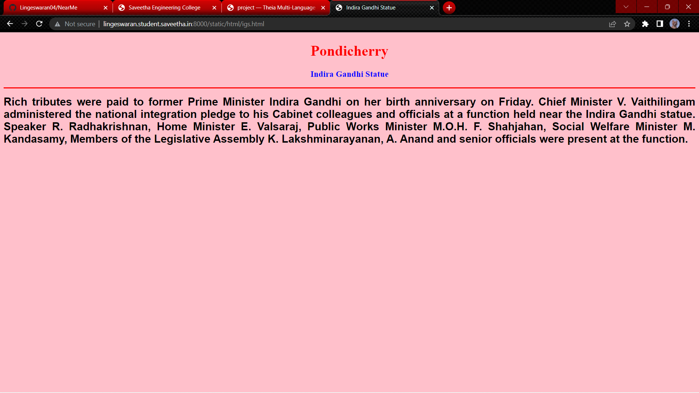
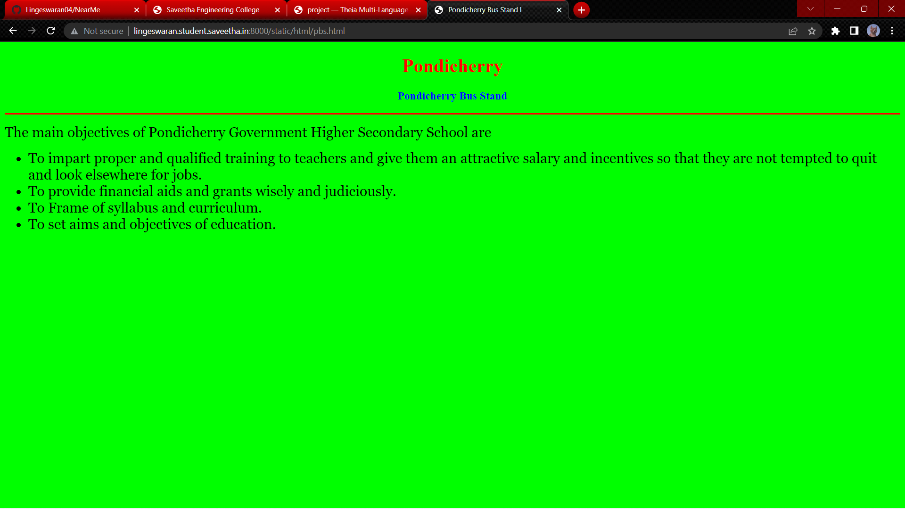
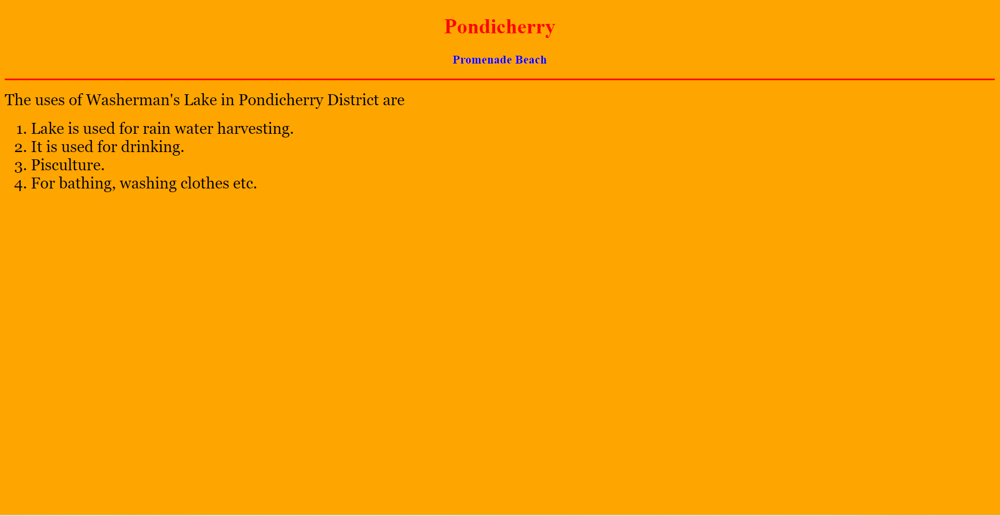
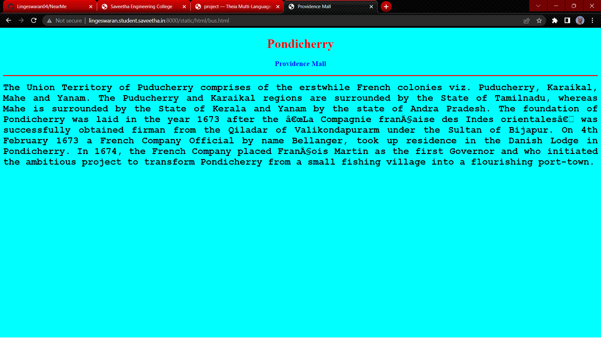
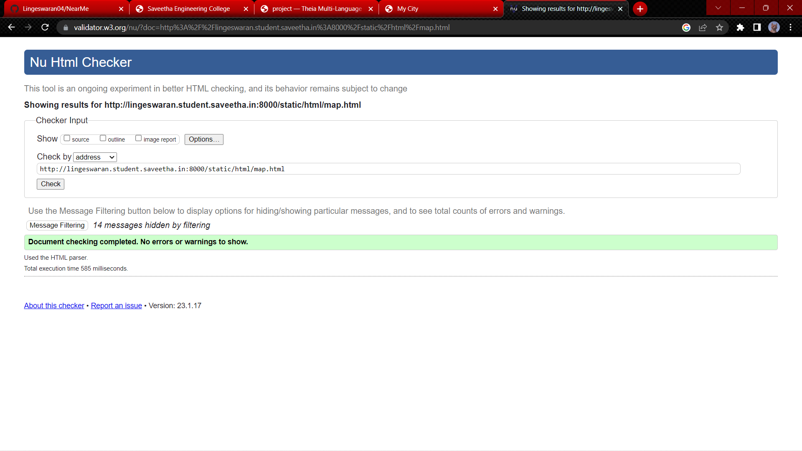

# Places Around Me
## AIM:
To develop a website to display details about the places around my house.

## Design Steps:

### Step 1:
clone the github repository intoTheia IDE.
### Step 2:
create a new django project
### Step 3:
write the needed HTML code.
### Step 4:
run the django server and execute the HTML files.
## Code:
```
map.html

<!DOCTYPE html>
<html lang="en">
<head>
<title>My City</title>
</head>
<body>
<h1 align="center">
<font color="red"><b>Puducherry</b></font>
</h1>
<h3 align="center">
<font color="blue"><b>Lingeswaran K(22005148)</b></font>
</h3>
<center>

<map name="MyCity">
<area shape="circle" coords="190,50,20" href="/static/html/pbs.html" title="Pondicherry Bus Stand">
<area shape="rectangle" coords="230,30,260,60" href="/static/html/rto.html" title="Indira Gandhi Statue">
<area shape="circle" coords="400,350,50" href="/static/html/pb.html" title="Promenade Beach">
<area shape="circle" coords="400,200,75" href="/static/html/bus.html" title="Providence Mall">
<area shape="rectangle" coords="490,150,870,320" href="/static/html/park.html" title="JIPMER Hospital">
</map>
</center>
</body>
</html>

jipmer.html

<!DOCTYPE html>
<html lang="en">
<head>
<title>Hospital</title>
</head>
<body bgcolor="yellow">
<h1 align="center">
<font color="red"><b></b></font>
</h1>
<h3 align="center">
<font color="blue"><b>JIPMER Hospital</b></font>
</h3>
<hr size="3" color="red">
<p align="justify">
<font face="Tahoma" size="5">
A very nice park near Pondicherry bus stand. It is located surrounding the Chetty Lake. 
Very superb calm place in Pondicherry. Best for walking. Nice playing place for kids.
Well maintained with jogging track. Source of ground water.
Good place play with children.  In Banyan Tree lot of parrot stay like house. 
Good sound and Air. Lake view park looks awesome.
Very nice place at Pondicherry.
Simple and relax with play area.
</font>
</p>
</body>
</html>

igs.html

<!DOCTYPE html>
<html lang="en">
<head>
<title> Indira Gandhi Statue </title>
</head>
<body bgcolor="pink">
<h1 align="center">
<font color="red"><b>Pondicherry</b></font>
</h1>
<h3 align="center">
<font color="blue"><b> Indira Gandhi Statue </b></font>
</h3>
<hr size="3" color="red">
<p align="justify">
<font face="Arial" size="5">
<b>
Rich tributes were paid to former Prime Minister Indira Gandhi on her birth anniversary on Friday. Chief Minister V. Vaithilingam administered the national integration pledge to his Cabinet colleagues and officials at a function held near the Indira Gandhi statue.
Speaker R. Radhakrishnan, Home Minister E. Valsaraj, Public Works Minister M.O.H. F. Shahjahan, Social Welfare Minister M. Kandasamy, Members of the Legislative Assembly K. Lakshminarayanan, A. Anand and senior officials were present at the function.
</b>
</font>
</p>
</body>
</html>

pbs.html

<!DOCTYPE html>
<html lang="en">
<head>
<title> Pondicherry Bus Stand l</title>
</head>
<body bgcolor="lime">
<h1 align="center">
<font color="red"><b>Pondicherry</b></font>
</h1>
<h3 align="center">
<font color="blue"><b> Pondicherry Bus Stand </b></font>
</h3>
<hr size="3" color="red">
<p align="justify">
<font face="Georgia" size="5">
The main objectives of Pondicherry Government Higher Secondary School are 
<ul>
<li>To impart proper and qualified training to teachers and give them an attractive salary and incentives so that they are not tempted to quit and look elsewhere for jobs.</li>
<li>To provide financial aids and grants wisely and judiciously.</li>
<li>To Frame of syllabus and curriculum.</li>
<li>To set aims and objectives of education.</li>
</ul>
</font>
</p>
</body>
</html>

pb.html

<!DOCTYPE html>
<html lang="en">
<head>
<title> Promenade Beach </title>
</head>
<body bgcolor="orange">
<h1 align="center">
<font color="red"><b>Pondicherry</b></font>
</h1>
<h3 align="center">
<font color="blue"><b> Promenade Beach </b></font>
</h3>
<hr size="3" color="red">
<p align="justify">
<font face="Georgia" size="5">
The uses of Washerman's Lake in Pondicherry District are 
<ol type="1">
<li>Lake is used for rain water harvesting.</li>
<li>It is used for drinking.</li>
<li>Pisculture.</li>
<li>For bathing, washing clothes etc.</li>
</ol>
</font>
</p>
</body>
</html>

```

## Output:








## HTML validator


## Result:
The program is executed successfully.
